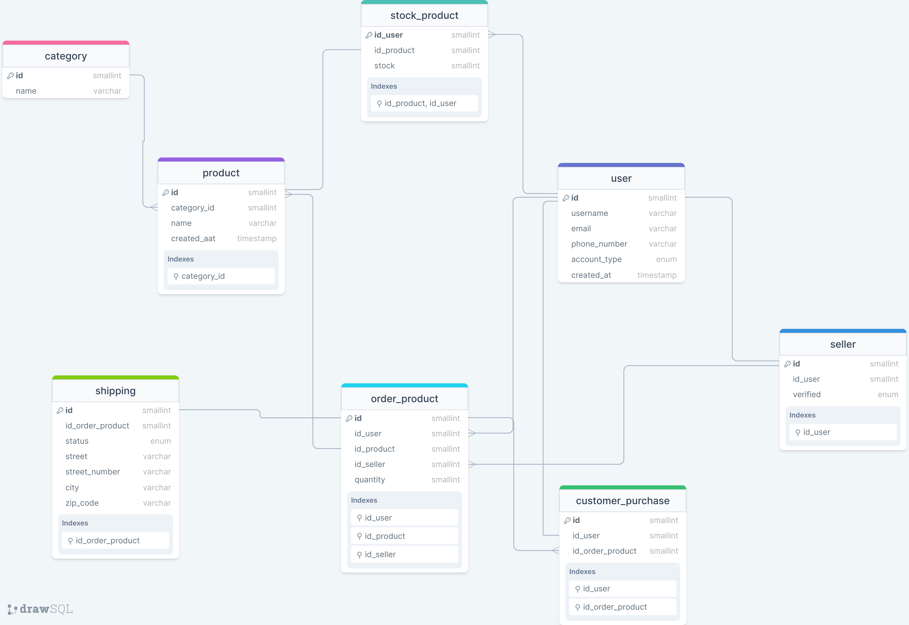

# Información del proyecto
Este proyecto tiene como objetivo poder aplicar todo los conceptos aprendidos en el curso de **[Fundamentos de bases de datos](https://platzi.com/cursos/bd/)** de **[Platzi](https://platzi.com/)**.

Mis objetivos con este curso es poder solidificar mis bases con respecto a las bases de datos y poder aplicarlas en mi camino como desarrollador.

## Contexto del proyecto
El proyecto consiste en crear una base de datos para una empresa de comercio electrónico llamada Mercado Free y esta se quiere convertir en una top a nivel local y poder expanderse a nivel regional.

## Requerimientos del proyecto
Los founders de Mercado Free nos han pedido que creemos una base de datos que cumpla con los siguientes requerimientos:

- [x] La base de datos debe ser relacionar.
- [x] Debe poseer la documentación de la base de datos para poder escalarla en un futuro.
- [x] Debe poseer las siguientes tablas:
Productos, Clientes, Pedidos, Categorías, Proveedores.
    - [x] Productos.
    - [x] Usuarios.
    - [x] Categorías.
    - [x] Vendedores.
    - [x] Pedidos.
    - [x] Detalles de pedidos.
    - [x] Reseña de productos.
    - [x] Compras del cliente.

### Diagrama ER

> Nota: El diagrama fue creado con la herramienta [drawSQL](https://drawsql.app/)
